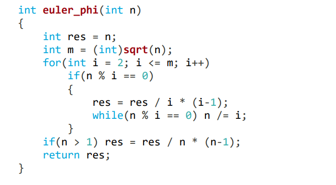
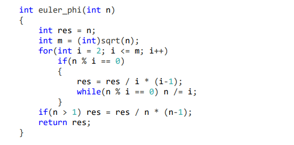
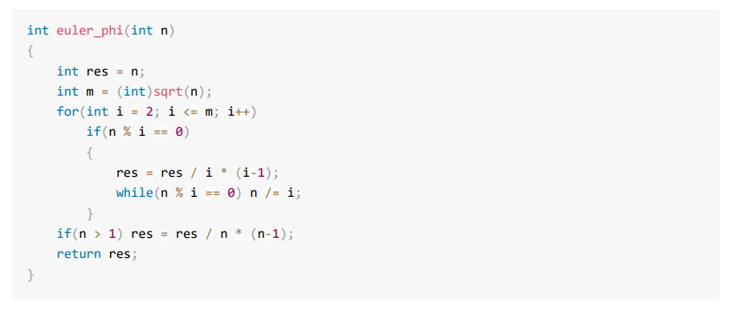

# gitbook_settings
`gitbook`的`book.json`文件配置:

以下高亮方式为:`prism.js`取消了自带的`highlight.js`

关于更多高亮样式:

1. [漂亮的代码语法高亮插件Prism.js简单使用文档](https://segmentfault.com/a/1190000009122617)
2. [Prism themes样式](https://github.com/PrismJS/prism-themes)

## 配置1:

```json
{
    "title": "riba2534-ACM-Template",
    "plugins": [
        "katex",
        "prism",
        "prism-themes",
        "-highlight"
    ],
    "pluginsConfig": {
        "prism": {
            "css": [
                "prism-themes/themes/prism-ghcolors.css"
            ]
        }
    }
}
```

高亮方式为:



## 配置2:

```json
{
    "title": "riba2534-ACM-Template",
    "plugins": [
        "katex",
        "prism",
        "prism-themes",
        "-highlight"
    ],
    "pluginsConfig": {
        "prism": {
            "css": [
                "prism-themes/themes/prism-vs.css"
            ]
        }
    }
}
```

高亮方式为：



## 配置3:

```json
{
    "title": "riba2534-ACM-Template",
    "plugins": [
        "katex",
        "prism",
        "-highlight"
    ],
    "pluginsConfig": {
        "prism": {
            "css": [
                "prismjs/themes/prism.css"
            ]
        }
    }
}
```

高亮方式为:




